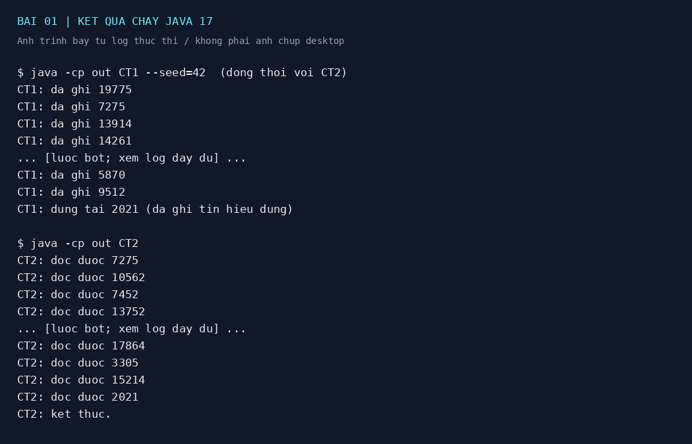
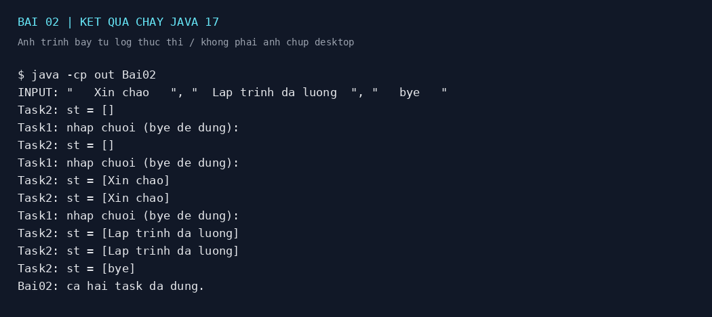
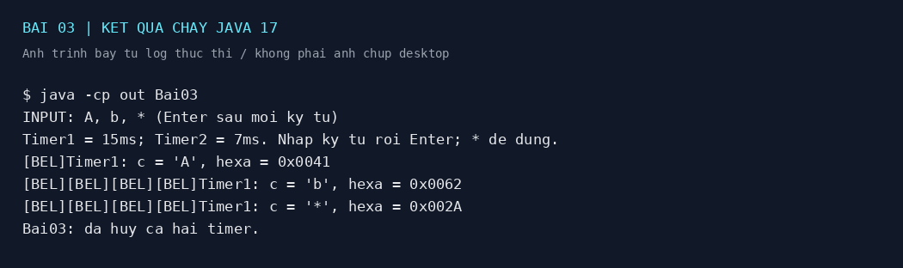
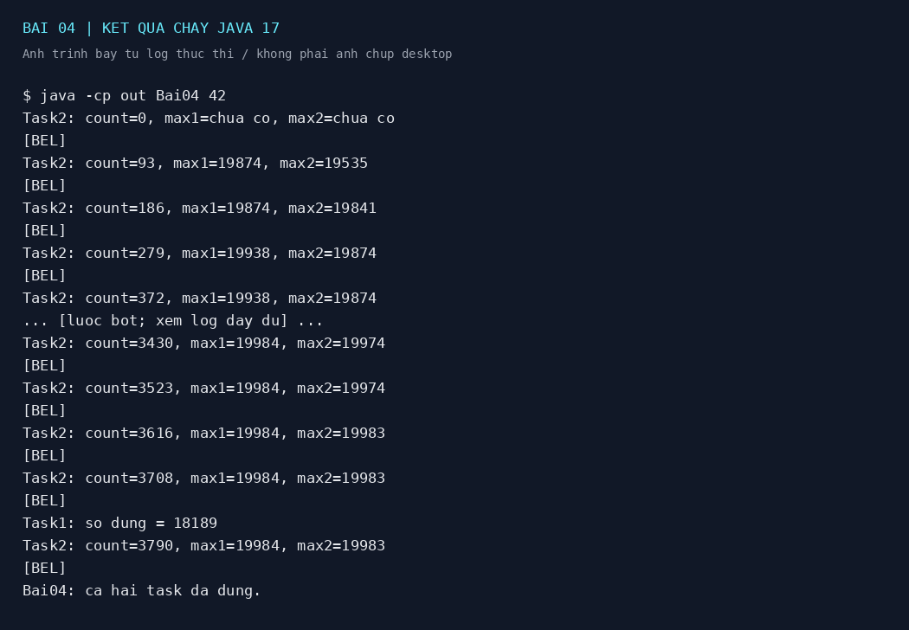

# Bài tập lập trình bất đồng bộ — Java

## Thông tin sinh viên

| Nội dung | Thông tin |
|---|---|
| Họ và tên | **ĐIỀN HỌ TÊN** |
| Mã sinh viên | **ĐIỀN MSSV** |
| Lớp | **ĐIỀN LỚP** |
| Môn học | **ĐIỀN MÔN HỌC** |
| Giảng viên | **ĐIỀN GIẢNG VIÊN** |
| Link Git | https://github.com/HP2k1/bai-tap-java |

## 1. Cấu trúc và môi trường

```text
src/CT1.java      Bài 01: chương trình ghi file, main riêng
src/CT2.java      Bài 01: chương trình đọc file, main riêng
src/Bai02.java    Hai luồng chia sẻ chuỗi
src/Bai03.java    Hai Timer 15ms và 7ms
src/Bai04.java    Sinh số, theo dõi hai giá trị lớn nhất
docs/            Ảnh trình bày kết quả từ log chạy thật
logs/            Toàn bộ log các lần chạy kiểm tra
build.bat        Biên dịch trên Windows
build.sh         Biên dịch trên Linux/macOS
```

Yêu cầu JDK 17, không cần thư viện ngoài, Maven hay Gradle. Các chương trình đã được biên dịch và chạy trên OpenJDK 17/Linux. Console dùng chữ không dấu để thuận tiện trên các terminal Windows.

Mở terminal tại thư mục chứa README, chạy:

```sh
javac -encoding UTF-8 -d out src/*.java
```

Trên Windows có thể chạy `build.bat`; Linux/macOS dùng `bash build.sh`. Trong VS Code cần mở đúng thư mục gốc để các chương trình cùng dùng một đường dẫn `dulieu.dat`.

## 2. Bài 01 — Trao đổi số nguyên qua file

### Cách chạy

Trước mỗi lượt chạy mới, bảo đảm đã đóng CT1/CT2 của lượt cũ, xóa `dulieu.dat` nếu tồn tại. Mở **hai terminal tại cùng thư mục gốc**.

Terminal 1:

```sh
java -cp out CT2
```

Terminal 2:

```sh
java -cp out CT1
```

CT1 tạo số ngẫu nhiên không âm trong đoạn `[0, 20210]`. Java `int` là số nguyên có dấu 32 bit, tương ứng 4 byte. File dùng big-endian, mỗi lần ghi đè chỉ chứa một số. Cả hai chương trình dùng khóa file trước khi truy cập, `try-with-resources` đóng khóa và file sau mỗi lần ghi/đọc. Mỗi `main` tạo một `Thread`, gọi `start()` rồi `join()`.

**Mâu thuẫn trong đề và hai chế độ:** Theo nguyên văn, CT1 thoát ngay khi sinh số chia hết cho 2021 mà không ghi số đó. Do vậy CT2 không thể nhận số kết thúc từ CT1. Không thể đồng thời giữ đúng quy tắc này và bảo đảm CT2 tự dừng bằng điều kiện đã cho.

- Mặc định: ghi thêm số chia hết cho 2021 trước khi CT1 dừng. Đây là điều chỉnh có chủ ý để CT2 cũng dừng đúng điều kiện.
- Chạy `java -cp out CT1 --strict`: CT1 làm đúng nguyên văn, không ghi số kết thúc. CT2 tiếp tục đọc; dùng Ctrl+C để dừng CT2. Chỉ nên nộp chế độ mặc định nếu giảng viên chấp nhận điều chỉnh đã nêu.

`--seed=42` là tùy chọn tái hiện chuỗi số dùng trong log. Không có tham số này thì số sinh thay đổi giữa các lần chạy. 0 cũng chia hết cho 2021 nên là giá trị kết thúc hợp lệ.

File là một ô chứa **giá trị mới nhất**, không phải hàng đợi: CT2 có thể đọc lặp lại một số hoặc bỏ qua số trung gian nếu CT1 ghi nhanh hơn. Điều này phù hợp cơ chế ghi đè của đề. Khóa chỉ bảo đảm đọc/ghi không chồng chéo, không bảo đảm nhận mọi số.



Log đầy đủ: [bai01.txt](logs/bai01.txt).

## 3. Bài 02 — Hai tác vụ chia sẻ chuỗi

```sh
java -cp out Bai02
```

Nhập lần lượt, dừng một chút giữa các dòng để quan sát:

```text
   Xin chao   
  Lap trinh da luong  
   bye   
```

Task1 dùng `strip()` cắt khoảng trắng ở hai đầu, giữ nguyên khoảng trắng bên trong. Biến tổng thể `static volatile String st` giúp Task2 thấy cập nhật từ Task1. Task2 lấy một bản chụp giá trị để hiển thị và kiểm tra dừng trên cùng một chuỗi. Hai tác vụ chạy bằng hai luồng riêng; `main` chờ bằng `join()`.

Task2 hiển thị mỗi khoảng 200ms để tránh làm ngập terminal. Chuỗi `bye` phân biệt hoa/thường. EOF được quy ước thành `bye` để không treo khi hết đầu vào. Do chỉ có một biến chứa giá trị mới nhất, nhập quá nhanh có thể khiến Task2 không kịp hiển thị một chuỗi trung gian.



Log đầy đủ: [bai02.txt](logs/bai02.txt).

## 4. Bài 03 — Hai timer

```sh
java -cp out Bai03
```

Nhập `A`, Enter; `b`, Enter; `*`, Enter. Console thông thường nhận đầu vào theo dòng nên cần Enter. CR/LF được bỏ qua.

| Timer | Chu kỳ yêu cầu | Xử lý |
|---|---:|---|
| Timer1 | 15ms | Kiểm tra dữ liệu sẵn sàng, đọc một ký tự, cập nhật `c`, in mã hexa |
| Timer2 | 7ms | Phát ký tự điều khiển BEL nếu `c` chưa là `*` |

`c` là biến tổng thể `volatile`. `CountDownLatch` giữ main chờ ký tự kết thúc. Khi nhận `*`, main hủy cả hai timer. Timer1 in mã đơn vị UTF-16 của Java `char`; ví dụ `A = 0x0041`, `b = 0x0062`, `* = 0x002A`. Với ký tự ngoài BMP, Java biểu diễn bằng hai `char`.

**Cách diễn giải vòng lặp trong đề:** Nếu đặt một vòng lặp vô hạn hoặc lệnh nhập chặn vào callback, timer sẽ không thể quay lại thực hiện theo chu kỳ. Bài làm chuyển mỗi lượt của vòng lặp thành một callback ngắn; `scheduleAtFixedRate` đảm nhiệm lặp lại. Đây là cách đáp ứng việc xử lý định kỳ, không phải vòng `while` vô hạn nằm trong callback. Cần trình bày rõ lựa chọn này khi bảo vệ bài.

15ms và 7ms là chu kỳ đặt lịch, không phải cam kết thời gian thực chính xác tuyệt đối. BEL chỉ nghe được nếu terminal bật chuông; môi trường chạy kiểm tra không xác minh được âm thanh thực tế. Không đổi chu kỳ timer để giả tạo tiếng beep. Dùng `*` để kết thúc; chương trình được thiết kế cho nhập tương tác, không bảo đảm phát hiện EOF trên mọi console khi dùng `ready()`.



Log đầy đủ: [bai03.txt](logs/bai03.txt). `[BEL]` trong log biểu diễn ký tự điều khiển âm thanh, không phải văn bản chương trình in ra.

## 5. Bài 04 — Hai giá trị lớn nhất

```sh
java -cp out Bai04
```

Task1 sinh số nguyên trong đoạn `[0, 20000]`, dừng khi số vừa sinh lớn hơn 10000 và chia hết cho 2021. Chọn phương án **luồng** mà đề cho phép; `sleep(1)` chỉ làm chậm để quan sát, không phải timer thời gian thực.

Task2 hiển thị số lượng đã sinh, số lớn nhất và số lớn nhì, đồng thời gửi BEL. Quy ước **lớn nhì là giá trị phân biệt lớn thứ hai**: dãy `9, 9, 4` có max1 là 9 và max2 là 4. Khi chưa có đủ giá trị, in `chua co`.

Mỗi số được Task1 cập nhật ngay dưới `synchronized(lock)`, kể cả số làm dừng. Task2 cũng lấy khóa đó để đọc một bộ kết quả nhất quán. Task2 dùng `wait(100)` để vừa nhả khóa, vừa giảm tốc độ hiển thị; Task1 dùng `notifyAll()` khi kết thúc để Task2 thức dậy và in kết quả cuối. Luồng quan sát chỉ thoát sau khi Task1 đã thoát vòng sinh số.

Console hiển thị theo chu kỳ khoảng 100ms, còn hai giá trị cực đại được cập nhật sau **mọi** lần sinh số. Không giữ khóa khi Task1 ngủ. Thuật toán cập nhật mất O(1) thời gian và O(1) bộ nhớ mỗi số.

Có thể chạy `java -cp out Bai04 42` để tái hiện chuỗi kiểm tra. Lần kiểm tra này sinh 3790 số, dừng ở 18189, max1 = 19984 và max2 = 19983. Thời điểm và số dòng quan sát có thể khác do lịch chạy các luồng.



Log đầy đủ: [bai04.txt](logs/bai04.txt).

## 6. Kết quả kiểm tra và ảnh nộp bài

- Biên dịch thành công cả 5 lớp có `main` bằng OpenJDK 17.
- Chạy CT1/CT2 đồng thời, xác nhận file dài đúng 4 byte và cả hai dừng ở số chia hết cho 2021.
- Kiểm tra Bài 02 với khoảng trắng hai đầu và `bye`.
- Kiểm tra Bài 03 với `A`, `b`, `*`; xác nhận mã hexa và hủy timer.
- Kiểm tra Bài 04 dừng đúng điều kiện, so sánh kết quả cuối với chuỗi ngẫu nhiên tái hiện độc lập.

**Nguồn ảnh:** Các PNG trong `docs/` là ảnh trình bày lại từ log chạy thật trong môi trường kiểm tra, không phải ảnh chụp màn hình desktop của sinh viên. Log dài được trích đầu/cuối và có đánh dấu lược bớt. Không coi các ảnh này là bằng chứng đã nghe được tiếng beep.

Để đáp ứng đúng yêu cầu ảnh chụp màn hình của đề, hãy chạy trên máy của mình, chụp terminal và lưu đè `docs/bai01.png` đến `docs/bai04.png`. Bài 01 cần thấy cả hai terminal. Bài 02 cần thấy chuỗi đã cắt dấu cách và `bye`. Bài 03 cần thấy ký tự/mã hexa và kết thúc bằng `*`. Bài 04 cần thấy số dừng và hai giá trị cực đại cuối. Sau khi thay ảnh, sửa đoạn mô tả nguồn ảnh này cho đúng.

## 7. Repository và hoàn thiện bản nộp

Repository: https://github.com/HP2k1/bai-tap-java

Mã nguồn, hướng dẫn, log và ảnh trình bày kết quả được lưu tại repository này. Trước khi nộp, điền thông tin sinh viên ở đầu README, chạy chương trình trên máy của mình và thay ảnh log bằng ảnh chụp terminal theo mục 6.

Sau khi cập nhật, kiểm tra cả bốn ảnh hiển thị trong README rồi nộp link repository ở trên.
